# AresBrain系统核心链路时序图

## 概述

本文档展示AresBrain系统中几个核心业务流程的时序图，包括代码差异分析、Ares代理管理、模块版本管理等核心功能。

## 1. 代码差异分析流程

### 1.1 标准差异分析流程

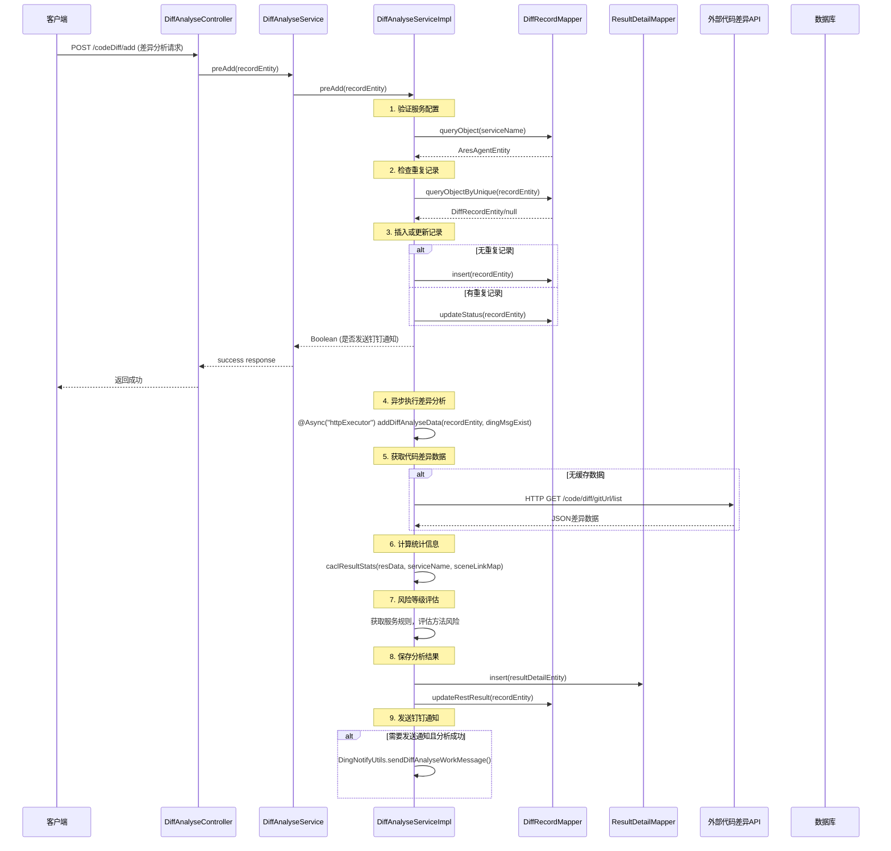

### 1.2 EPAAS差异分析流程（基于TraceId过滤）

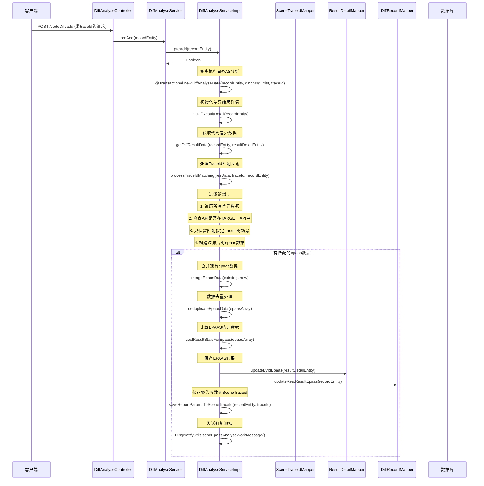

## 2. Ares代理管理流程

### 2.1 Ares代理配置管理

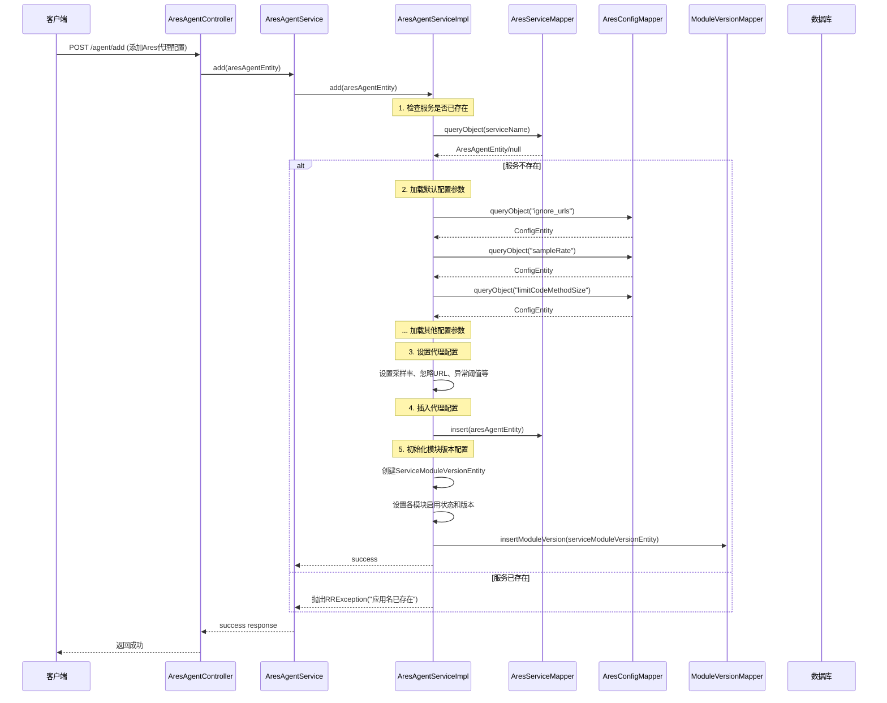

### 2.2 服务器信息同步流程

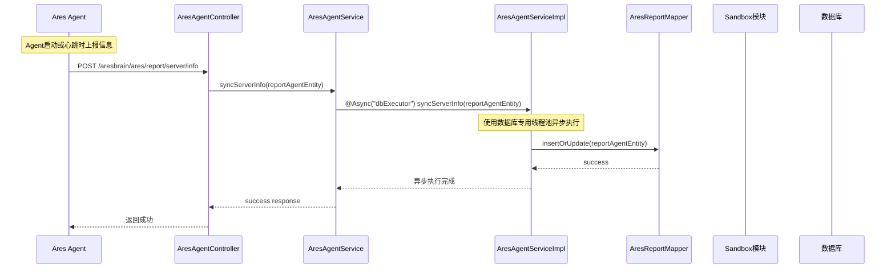

### 2.3 模块状态查询流程

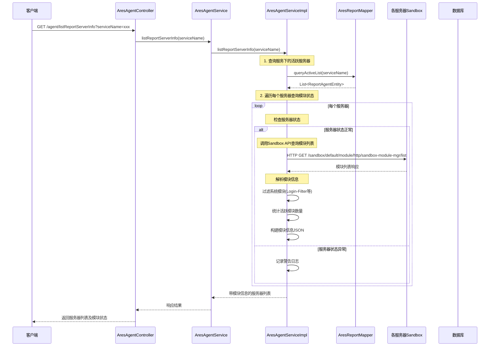

## 3. 模块版本管理流程

### 3.1 模块版本添加流程

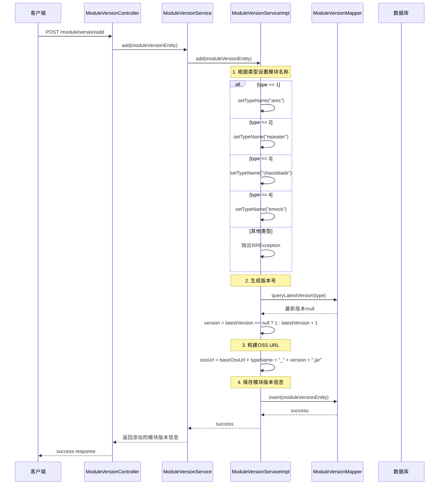

### 3.2 模块激活/冻结流程

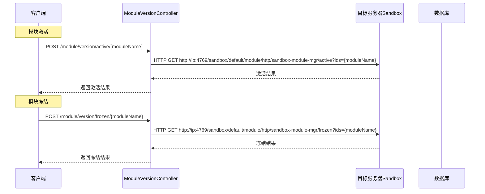

## 4. 场景管理流程

### 4.1 场景详情查询流程

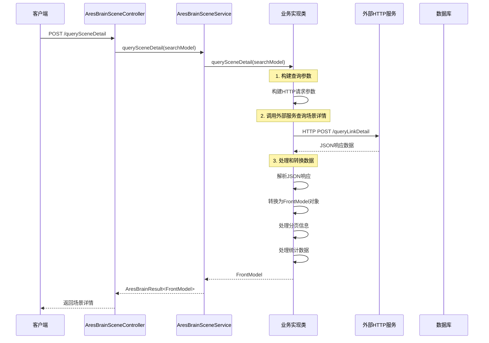

### 4.2 批量场景分析流程

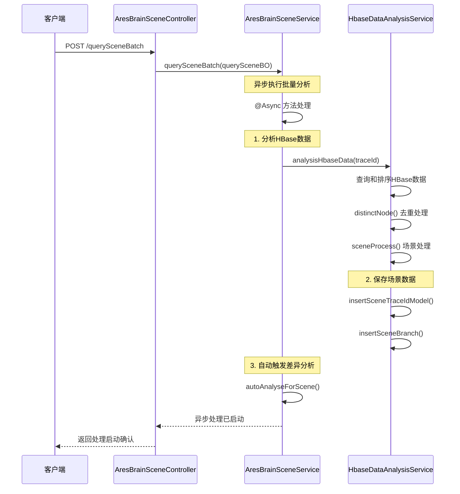

## 5. 异步处理和监控流程

### 5.1 线程池监控流程

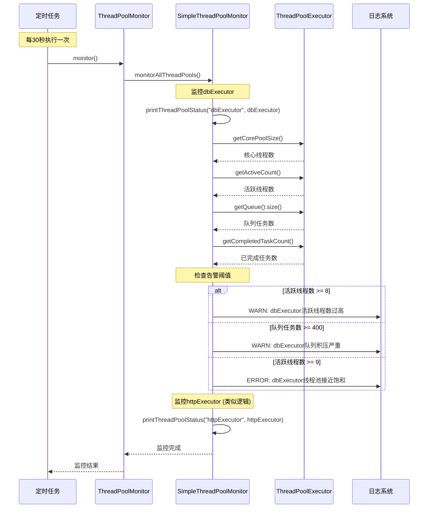

### 5.2 HTTP客户端超时处理流程

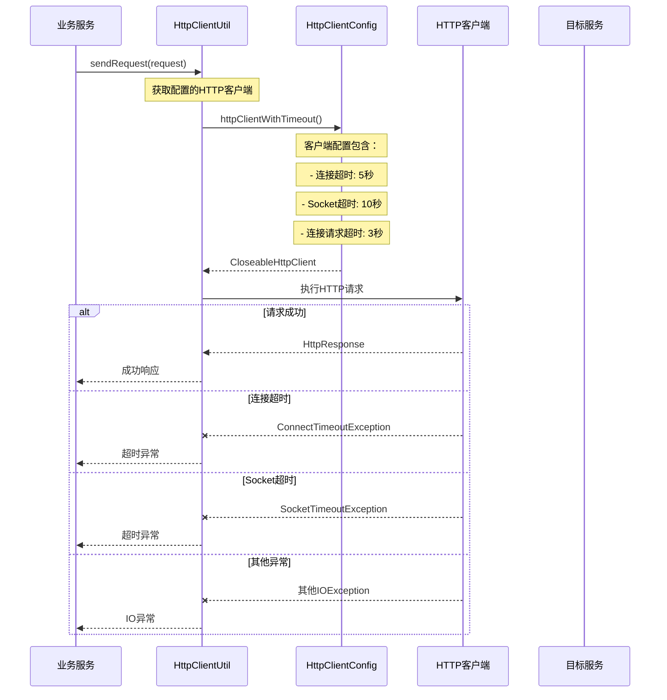

## 总结

这些时序图展示了AresBrain系统的核心业务流程：

1. **代码差异分析**：支持标准和EPAAS两种模式，包含异步处理、风险等级评估、统计计算等功能
2. **Ares代理管理**：完整的代理配置管理、服务器信息同步、模块状态查询功能
3. **模块版本管理**：模块版本添加、激活/冻结管理等核心功能
4. **场景管理**：场景详情查询、批量分析等复杂业务流程
5. **异步处理和监控**：线程池监控、HTTP客户端超时处理等基础设施功能

系统采用了异步处理、多线程池、超时控制等技术手段，确保了系统的稳定性和高性能。同时通过完整的监控和告警机制，保证了系统的可观测性。